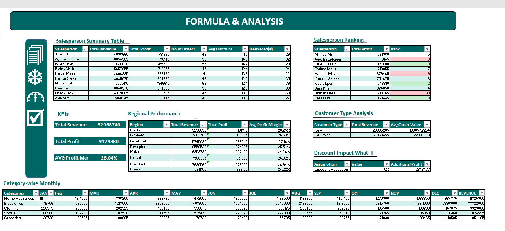

# Retail Business Intelligence System | Excel

### An End-to-End Excel Project for Sales, Profitability, and Performance Analysis

## Project Overview

This project demonstrates a complete Business Intelligence workflow in Microsoft Excel using a retail sales dataset. The objective was to transform raw transactional data into actionable business insights through data cleaning, advanced formulas, Pivot Table analysis, interactive dashboards, and executive reporting.

The final solution enables stakeholders to monitor sales performance, profitability, regional trends, salesperson effectiveness, and operational metrics to support data-driven decision-making.

---

## Dataset

The dataset contains 500 retail sales transactions with the following fields:

- Country
- Order Value (EUR)
- Cost
- Date
- Category
- Customer Name
- Sales Manager
- Sales Representative
- Device Type
- Order ID

---

## Data Cleaning & Preparation

The following data preparation steps were performed:

- Checked and validated duplicate Order IDs
- Converted the dataset into an Excel Table
- Standardized date formats
- Created Month, Quarter, and Year columns for time-based analysis
- Added Profit Margin calculations
- Created High-Value Order flags using logical formulas
- Applied Conditional Formatting to identify data anomalies and negative profits
- Validated data quality before analysis

---

## Formulas & Functions Used

### Key Calculations

```excel
Profit = Revenue - Cost
```

```excel
Profit Margin % = (Profit / Revenue) * 100
```

### Excel Functions Used

- SUMIFS()
- COUNTIFS()
- AVERAGEIFS()
- IF()
- AND()
- RANK()
- TEXT()
- MONTH()
- YEAR()

---

## Formula & Analysis Sheet

This sheet contains advanced analytical calculations and business summaries, including:

- Salesperson Performance Analysis
- Regional Performance Analysis
- Customer Type Analysis
- Salesperson Ranking
- Category-wise Revenue Analysis
- Discount Impact What-If Analysis

### Screenshot



---

## Pivot Table Analysis

Pivot Tables were created to analyze business performance from multiple perspectives:

- Revenue by Region, Category, and Salesperson
- Monthly Revenue and Profit Trends
- Delivery Status Analysis
- Customer Type Performance
- Interactive Filtering using Slicers

### Screenshot


---

## Dashboard

An interactive dashboard was developed to provide a high-level overview of business performance.

### KPIs

- Total Revenue
- Total Profit
- Profit Margin
- Top Salesperson
- Best Performing Region
- Total Orders Delivered

### Visualizations

- Regional Revenue Comparison
- Monthly Revenue vs Profit Trend
- Category Revenue Distribution
- Top 5 Salespersons by Profit

### Screenshot


---
## Key Findings

- 🏆 **Lahore** is the top revenue region at PKR 7.9M but records 
  the lowest profit margin at 24.22%
- 📦 **Electronics** dominates with 63% of total revenue
- 📅 **September** is the peak revenue month at PKR 6.0M
- 👤 **Bilal Hussain** is the top salesperson with PKR 1.4M profit
- 🚚 Delivery rate stands at 58% — 290 of 500 orders delivered

## Executive Summary & Recommendations

A final reporting sheet was created to communicate insights and recommendations to business stakeholders.

Key focus areas include:

- Regional performance evaluation
- Product category profitability
- Salesperson effectiveness
- Delivery performance
- Impact of discount policies on profitability

### Screenshot


---

## Skills Demonstrated

- Microsoft Excel
- Data Cleaning & Validation
- Business Intelligence
- Advanced Excel Formulas
- Pivot Tables & Pivot Charts
- Dashboard Design
- KPI Development
- Data Visualization
- What-If Analysis
- Executive Reporting

---

## Project Outcome

This project transformed raw retail sales data into a complete Business Intelligence solution that provides actionable insights into revenue, profit, customer behavior, and operational performance, enabling better business decision-making.

---
*Project by [Areesha Gaba](https://www.linkedin.com/in/areesha-gaba/) | Ash DeCodes*
